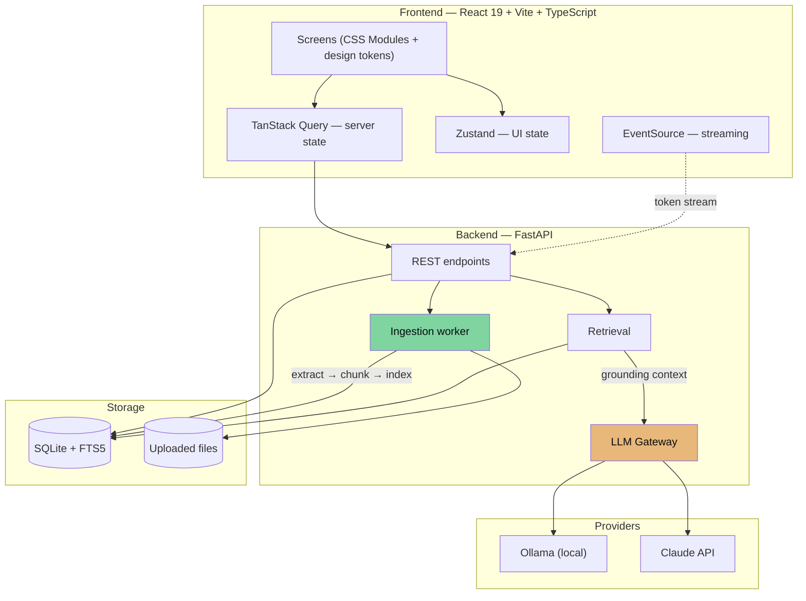
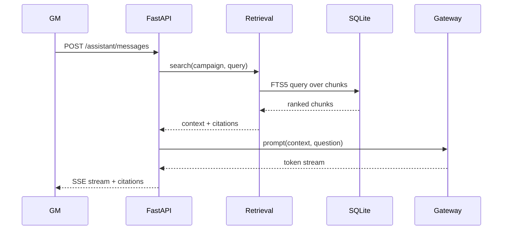

# Architecture

## Shape



The green path is deterministic and never calls a model. The amber path is the only
place a model is invoked.

## Stack

| Layer | Choice | Rationale |
|-------|--------|-----------|
| Frontend framework | React 19 + TypeScript (strict) | [ADR-0001](adr/adr-0001-react-vite-spa.md) |
| Build / dev server | Vite | Same ADR — SPA with no SSR need |
| Routing | React Router v7 | Client routing matches the design's screen model |
| Server state | TanStack Query | Caching, polling for document status, invalidation |
| UI state | Zustand | Rail expansion, panel open, sheets, filters |
| Component primitives | Radix UI | Unstyled and accessible; the design is fully custom |
| Styling | CSS Modules + CSS custom properties | [ADR-0004](adr/adr-0004-css-modules-over-tailwind.md) |
| Component docs | Storybook | Primitives are documented as they are built |
| Backend | Python 3.11+ / FastAPI | [ADR-0001](adr/adr-0001-react-vite-spa.md) |
| Storage | SQLite + FTS5 | [ADR-0003](adr/adr-0003-sqlite-single-store.md) |
| Extraction | PyMuPDF, pdfplumber | Deterministic; [ADR-0002](adr/adr-0002-deterministic-extraction.md) |
| LLM access | Gateway over Ollama + Claude | [ADR-0006](adr/adr-0006-llm-gateway.md) |
| Testing | Vitest + Testing Library, Playwright, pytest | |

## Repository layout

A plain workspace, not an Nx monorepo — two apps and a small shared library do not need
a build orchestrator.

```
dm_assistant/
├── docs/                     # this documentation
├── frontend/
│   ├── src/
│   │   ├── app/              # router, providers, shell
│   │   ├── screens/          # login, campaigns, workspace views
│   │   ├── features/         # documents, characters, factions, quests,
│   │   │                     #   sessions, graph, assistant
│   │   ├── ui/               # Radix wrappers + design-token primitives
│   │   ├── styles/           # tokens.css, reset, global
│   │   └── lib/              # api client, hooks, utils
│   └── vite.config.ts
├── backend/
│   ├── app/
│   │   ├── api/              # routers per resource
│   │   ├── core/             # config, db session
│   │   ├── models/           # SQLAlchemy models
│   │   ├── ingestion/        # extract, chunk, index (no LLM)
│   │   ├── retrieval/        # FTS5 search, context assembly
│   │   └── gateway/          # provider abstraction
│   └── pyproject.toml
└── README.md
```

## Ingestion pipeline

Deterministic end to end. No model is called at any step.

```mermaid
sequenceDiagram
    participant U as GM
    participant API as FastAPI
    participant W as Worker
    participant DB as SQLite

    U->>API: POST /documents (file)
    API->>DB: insert document (status=queued, progress=0)
    API-->>U: 202 + document id
    Note over U,API: UI polls status; upload never blocks

    W->>DB: claim queued document
    W->>DB: status=processing
    W->>W: extract text (PyMuPDF / pdfplumber)
    W->>W: split into chunks with headings + page spans
    W->>DB: insert chunks
    W->>DB: populate FTS5 index
    W->>DB: status=indexed, progress=100
```

Failure sets `status=failed` and records `error`. Progress is written per processed page
so the design's percentage bar reflects real work.

## Retrieval and grounding



**The grounding rule.** The prompt instructs the model to answer only from supplied
context and to state plainly when the context does not contain the answer (PRIN-001,
AC-003). Retrieved chunk ids are returned with the response and stored as citations, so
every factual claim is traceable to a source.

GM-private `notes` are excluded from retrieval context by default (DEC-004).

## Frontend state

Three distinct concerns, deliberately not merged:

- **Server state** — TanStack Query. Campaigns, entities, documents, messages. Document
  status polls while any document is `queued` or `processing`, then stops.
- **UI state** — Zustand. `navHover`, `navPinned`, `panelOpen`, `moreOpen`, `mob`,
  filters, composer visibility. Ephemeral, never persisted.
- **Streaming** — an `EventSource` per in-flight assistant message, appending tokens to
  the message being rendered.

The prototype holds all of this in one class component. That is correct for a prototype
and wrong for the app: server data and UI chrome have different lifetimes.

## Boundaries that matter

**BND-001 — No model in the ingestion path.** Enforced structurally: `ingestion/` has no
import path to `gateway/`. A test asserts this.

**BND-002 — All model calls go through the Gateway.** No provider SDK is imported outside
`gateway/`. Provider switching is configuration, not code.

**BND-003 — Campaign scoping is enforced server-side.** Every query filters by
`campaign_id`. The frontend never sees another campaign's data.

**BND-004 — The design prototype is never imported.** `Referee Workspace.dc.html` and
`support.js` are references. Values are transcribed into tokens; markup is rebuilt.
