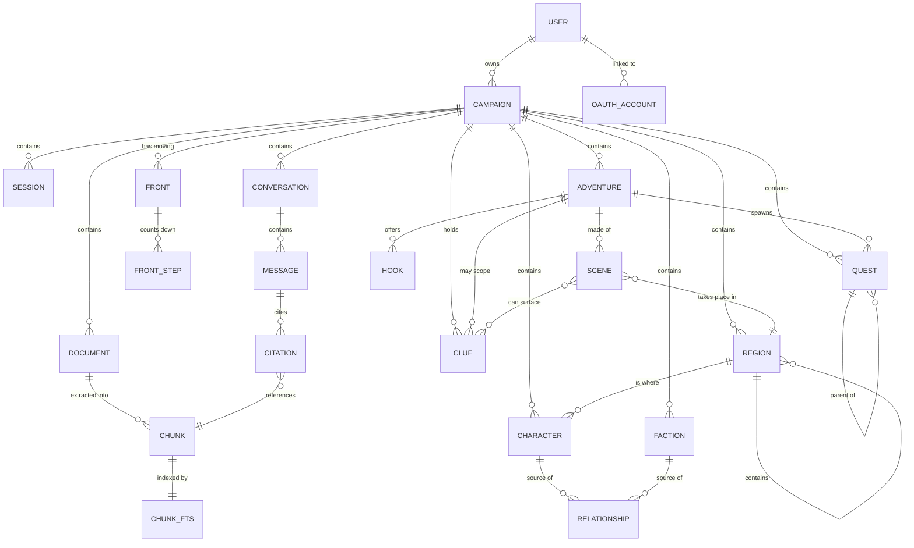

# Data Model

Derived from the entity shapes in the design prototype. Storage is a single SQLite
database ([ADR-0003](adr/adr-0003-sqlite-single-store.md)).

## Entity overview

## Core entities

### Campaign

The top-level isolation boundary. Everything else belongs to exactly one campaign.

| Field | Type | Notes |
|-------|------|-------|
| `id` | text PK | slug, e.g. `ashfall` |
| `name` | text | "Ashfall Reach" |
| `system` | text | **Required.** `D&D 2024` \| `Traveller 2e` |
| `image_path` | text? | user upload; falls back to a tint gradient |
| `tint` | text | hex accent for the placeholder banner |
| `session_count` | int | derived from sessions |
| `last_played_at` | date? | drives the "Jul 5" meta line |
| `created_at` | timestamp | |

### Character

**One entity for NPCs and player characters**, distinguished by `is_player`. The design
renders them through different views but shares stats, connections, and portrait handling.

| Field | Type | Notes |
|-------|------|-------|
| `id` | int PK | |
| `campaign_id` | text FK | |
| `name` | text | |
| `role` | text | "Human Cleric", "Merchant Prince" |
| `level` | int? | |
| `is_player` | bool | splits NPC list from Party list |
| `relationship` | enum | `ally` \| `enemy` \| `family` \| `professional` \| `neutral` — drives colour everywhere |
| `location` | text? | "The Party", "Market Row" |
| `disposition` | text? | "Steadfast", "Active" |
| `last_seen` | text? | "Session 13" |
| `armor_class`, `hit_points`, `speed` | text? | free-form; systems differ |
| `stats` | json | `[{k:"STR",v:14}, …]` — system-agnostic key/value |
| `quote` | text? | |
| `notes` | text? | GM-private notes |
| `portrait_path` | text? | |
| `tags` | json | `["Healer","Faith"]` |

**Player-character extension** (present when `is_player`), stored as a `player_profile`
JSON column rather than a separate table — it is always fetched with the character and
never queried independently:

`player_name`, `class`, `race`, `background`, `xp`, `pronouns`, `bonds`

### Faction

| Field | Type | Notes |
|-------|------|-------|
| `id` | int PK | |
| `campaign_id` | text FK | |
| `name` | text | "The Pale Court" |
| `type` | text | "Hidden cabal", "Merchant guild" |
| `relationship` | enum | same five values as Character |
| `influence` | text | "High", "Unknown" |
| `reach` | text | "Old Quarter", "Everywhere" |
| `motto` | text? | |
| `goal` | text? | |
| `notes` | text? | GM-private |

Faction membership is a join table `faction_member(faction_id, character_id)`. The
prototype stores members as names; real storage uses references so renames propagate.

### Relationship

Polymorphic edges powering the knowledge graph and the "Connections" lists on detail
pages. Characters and factions both participate.

| Field | Type | Notes |
|-------|------|-------|
| `id` | int PK | |
| `campaign_id` | text FK | |
| `source_type` | enum | `character` \| `faction` |
| `source_id` | int | |
| `target_type` | enum | `character` \| `faction` |
| `target_id` | int | |
| `kind` | enum | `ally` \| `enemy` \| `family` \| `professional` \| `neutral` |

Edges are treated as **undirected** for graph rendering; store one row per pair and
resolve in both directions on read.

### Quest

| Field | Type | Notes |
|-------|------|-------|
| `id` | int PK | |
| `campaign_id` | text FK | |
| `parent_quest_id` | int? FK | self-reference for subquests |
| `title` | text | |
| `subtitle` | text? | rendered as "Subquest of …" |
| `status` | enum | `available` \| `inprogress` \| `completed` \| `failed` \| `inactive` |
| `steps_done` | int | `cur` |
| `steps_total` | int | `max`; `0` means untracked |
| `color` | text | hex used by the portrait tile |
| `glyph` | text | single character for the tile |
| `is_person_quest` | bool | shows the person icon |

### Region

Places. A region contains other regions, so "the Old Quarter" holds "Market Row" holds
"The Gilded Flagon" — one entity type at every scale rather than separate Region and
Location tables.

| Field | Type | Notes |
|-------|------|-------|
| `id` | int PK | |
| `campaign_id` | text FK | |
| `parent_region_id` | int? FK | self-reference; null for top level |
| `name` | text | "The Old Quarter", "The Gilded Flagon" |
| `kind` | enum | `realm` \| `settlement` \| `district` \| `site` \| `building` \| `wilderness` |
| `is_notable` | bool | **Surfaces it on the parent's page** — see below |
| `summary` | text? | One line, for lists and hover cards |
| `description` | text? | What the party sees on arriving |
| `read_aloud` | text? | Boxed text to read at the table |
| `notes` | text? | GM-private: secrets, what is really going on |
| `image_path` | text? | |
| `tags` | json | `["Urban","Dangerous"]` |

**`is_notable` is a separate axis from hierarchy, deliberately.** The tavern where the party
always meets matters more than a street named once, regardless of how deep it nests. A
region's page shows its notable children as a short list a GM can reach in one click
mid-session; everything else stays in the tree. Without this, "easy to find" degrades into
"navigable if you remember where you put it".

Regions link to characters (`character.region_id`, replacing the free-text `location`) and
participate in `relationship` edges, so a faction can control a district and the graph shows
it.

### Adventure

A story unit above quests: premise, the reasons a party gets involved, and the scenes it is
made of. Modelled on how published modules are actually structured — background, hooks,
acts, NPCs, rewards.

| Field | Type | Notes |
|-------|------|-------|
| `id` | int PK | |
| `campaign_id` | text FK | |
| `title` | text | "The Broker's Old Bargain" |
| `premise` | text? | One paragraph: what this is about |
| `background` | text? | **GM-private.** What is really happening, which players discover through play |
| `status` | enum | `draft` \| `ready` \| `running` \| `completed` \| `abandoned` |
| `level_range` | text? | "3–5"; free-form, systems differ |
| `expected_sessions` | int? | Rough length |
| `region_id` | int? FK | Where it takes place |
| `structure` | enum | How PCs move between scenes — see below |
| `notes` | text? | GM-private |
| `tags` | json | `["Intrigue","Urban"]` |

**`structure`** distinguishes two families a GM prepares very differently:

| Family | Values | Prep it needs |
|--------|--------|---------------|
| **Procedural** — emergent | `dungeon_crawl` \| `hex_crawl` \| `point_crawl` \| `node_based` | Flexible **tools**: maps, tables, clue lists |
| **Story-driven** — directed | `linear` \| `branching` \| `mystery` | Prepared **plans**: outlines, scripts, set pieces |

An adventure may blend or nest them, so this is the dominant shape rather than an exclusive
category.

**`hook`** — a dramatic challenge the party is motivated to take on. Hooks are the
adventure's *objectives*, not merely its opening.

| Field | Type | Notes |
|-------|------|-------|
| `id` | int PK | |
| `adventure_id` | int FK | |
| `text` | text | "Recover the Envoy's cipher before the Court does" |
| `kind` | enum | `combat` \| `exploration` \| `investigation` \| `social` |
| `is_proactive` | bool | Proactive hooks come looking for the PCs; reactive ones must be found |
| `motivation` | text? | "Duty", "Greed" — which characters it catches |

**`kind`** matters for balance. Four combat hooks and nothing social produces a narrow
adventure, and the tag makes that visible without reading each one.

**`scene`** — the beats an adventure is made of. Ordered, but a GM runs them in whatever
order the table produces.

| Field | Type | Notes |
|-------|------|-------|
| `id` | int PK | |
| `adventure_id` | int FK | |
| `ordinal` | int | Suggested order |
| `title` | text | "Smoke over Riverside" |
| `purpose` | text? | Free-form beat label — see templates below |
| `summary` | text? | What happens, in a line |
| `read_aloud` | text? | Boxed text |
| `gm_notes` | text? | GM-private: what can go wrong, what the NPCs want |
| `region_id` | int? FK | Where it happens |
| `is_optional` | bool | Skippable if time runs short |

**`purpose` is free text, not an enum**, because the useful beat labels differ by template:

| Template | Beats |
|----------|-------|
| **Five-Room Dungeon** | Entrance · Obstacle · Setback · Climax · Reward |
| **Five-Node Mystery** | Hook · three POIs · Reveal |
| **The Quest** | Hook · Acquisition · Challenges · Complications · Closure |

Templates are *starting points a GM outlines from*, not a schema. Constraining `purpose` to
one template's vocabulary would have made the other two awkward to express.

Scenes are called scenes, not rooms, deliberately: the same structures drive urban intrigue
and investigation, not only dungeons.

**Joins**

| Table | Purpose |
|-------|---------|
| `adventure_character` | Which NPCs appear, with a `role` note ("the client", "the twist") |
| `adventure_faction` | Which factions are involved and how |
| `scene_character` | Which NPCs are present in a given scene |
| `scene_clue` | Which clues *can* surface in a scene — many-to-many, deliberately |

Quests gain `adventure_id` (nullable) so a quest can belong to an adventure or stand alone.

### Front

**Adventures are born from the movement of fronts** — goal-oriented threats that advance
whether or not the PCs engage. A front belongs to the campaign, not to one adventure: it
is what makes a world feel like it is moving.

| Field | Type | Notes |
|-------|------|-------|
| `id` | int PK | |
| `campaign_id` | text FK | |
| `name` | text | "The Pale Court's search for the cipher" |
| `kind` | enum | `threat` \| `asset` — an allied faction works the same way, with assets instead of dangers |
| `goal` | text | What it is driving toward |
| `stakes` | text? | The open question: how will this land on the PCs or the world? |
| `status` | enum | `looming` \| `active` \| `resolved` \| `averted` |
| `notes` | text? | GM-private |

**`front_step`** — the timeline. A countdown clock: what happens next if nobody stops it.

| Field | Type | Notes |
|-------|------|-------|
| `id` | int PK | |
| `front_id` | int FK | |
| `ordinal` | int | Sequence |
| `text` | text | "The Watch captain is replaced" |
| `is_done` | bool | Ticked when it happens at the table |
| `trigger` | text? | What advances it, if not simply time |

Fronts link to characters and factions through `front_participant`, so "who is behind this"
is queryable and shows up in the knowledge graph.

A simple threat needs only a goal and a three-step timeline — the model should not demand
more than that to be useful.

### Clue

**Clues are not owned by a scene.** They are discrete pieces of information that can surface
anywhere, and binding one to a single location is how a party gets stuck.

| Field | Type | Notes |
|-------|------|-------|
| `id` | int PK | |
| `campaign_id` | text FK | |
| `adventure_id` | int? FK | Null for campaign-wide secrets |
| `text` | text | "The cipher was moved before the fire" |
| `reveals` | text? | The secret it points to — used to group clues |
| `is_essential` | bool | Marks a narrative chokepoint |
| `is_revealed` | bool | Ticked when the party learns it |

**The three-clue rule.** Any secret the adventure depends on needs **at least three** clues
pointing at it, because players miss things. `is_essential` plus grouping by `reveals` makes
that checkable: the UI can warn when an essential secret has fewer than three routes to it.

This is why `scene_clue` is many-to-many. A clue that can only appear in one place is the
failure the rule exists to prevent.

### Document and Chunk

The ingestion pipeline's output. See [architecture.md](architecture.md).

**`document`**

| Field | Type | Notes |
|-------|------|-------|
| `id` | int PK | |
| `campaign_id` | text FK | |
| `filename` | text | "Core Rulebook v3.pdf" |
| `kind` | enum | `PDF` \| `DOC` \| `IMG` |
| `page_count` | int? | |
| `meta` | text? | "stat blocks · rules" |
| `status` | enum | `queued` \| `processing` \| `indexed` \| `failed` |
| `progress` | int | 0–100, drives the progress bar |
| `error` | text? | populated on `failed` |
| `file_path` | text | original on disk |
| `uploaded_at` | timestamp | |

**`chunk`**

| Field | Type | Notes |
|-------|------|-------|
| `id` | int PK | |
| `document_id` | int FK | |
| `ordinal` | int | position within document |
| `page_from`, `page_to` | int? | for citations |
| `heading` | text? | nearest section heading |
| `content` | text | the indexed text |

Retrieval uses an FTS5 virtual table over `chunk.content`
([ADR-0005](adr/adr-0005-fts5-before-vectors.md)).

### Session

| Field | Type | Notes |
|-------|------|-------|
| `id` | int PK | |
| `campaign_id` | text FK | |
| `title` | text | "The Vaults Below" |
| `played_on` | date | renders as day + month tile |
| `duration` | text? | "3h 40m" |
| `summary` | text? | plain-text summary |
| `body_html` | text? | rich-text composer output |
| `tags` | json | `["Combat","Discovery"]` |

Session bodies are chunked and indexed like documents, so past sessions are retrievable.

### Conversation, Message, Citation

| Entity | Key fields |
|--------|-----------|
| `conversation` | `id`, `campaign_id`, `started_at` |
| `message` | `id`, `conversation_id`, `role` (`user`\|`assistant`), `content`, `created_at`, `tool_label?` |
| `citation` | `id`, `message_id`, `chunk_id`, `quote?` |

Citations satisfy AC-002 and make grounding auditable.

### User

A real account. v1 authenticates ([ADR-0008](adr/adr-0008-own-auth-v1.md)).

| Field | Type | Notes |
|-------|------|-------|
| `id` | int PK | |
| `email` | text UNIQUE | The login identifier |
| `password_hash` | text? | **Nullable** — argon2. Null for Google-only accounts |
| `display_name` | text | "Game Master" |
| `table_name` | text? | "The Ashfall Table" |
| `avatar_path` | text? | Upload |
| `email_verified` | bool | |
| `created_at` | timestamp | |

`password_hash` is nullable so an account created through Google has no password at all —
storing a placeholder would be worse than storing nothing.

**Supporting tables**

| Table | Fields | Purpose |
|-------|--------|---------|
| `oauth_account` | `user_id`, `provider`, `provider_user_id` | Links a Google identity to a user |
| `password_reset` | `user_id`, `token_hash`, `expires_at`, `used_at` | Single-use reset tokens |
| `refresh_token` | `user_id`, `token_hash`, `expires_at`, `revoked_at` | Long-lived sessions |

**Tokens are stored hashed, never in the clear** — same reasoning as passwords. A database
read must not yield anything usable to log in with.

## Modelling decisions worth noting

**DEC-001 — Characters and players are one table.**
The design's `isPlayer` flag, shared stat block, and shared connection list make a single
table the honest model. Splitting them would duplicate every shared column and complicate
the graph, which does not care which kind a node is.

**DEC-002 — `stats` is JSON, not columns.**
D&D 2024 and Traveller 2e have different attributes. A fixed six-column stat block would
be wrong for one of the two systems the picker requires on day one.

**DEC-003 — Relationships are first-class rows, not embedded lists.**
The prototype embeds `connections` in each entity. Real storage needs edges queryable
from both ends to render a graph without loading every entity.

**DEC-005 — Campaigns carry `owner_id`; everything else scopes through campaign.**
`campaign.owner_id` references `user`. Characters, quests, and documents scope by
`campaign_id` and inherit ownership through it, so a single join answers "may this user see
this row?" Denormalising `owner_id` onto every table would create two sources of truth that
can disagree.

This makes `BND-003` load-bearing rather than tidy: with real users, a missed owner filter
is a data leak, not an inconvenience. Enforce it in the repository layer, and test it
(IMP-011 in [ADR-0008](adr/adr-0008-own-auth-v1.md)).

**DEC-006 — One Region entity at every scale, with notability as a separate flag.**
A realm, a district, and a tavern are the same kind of thing differing in scope, so one
self-referencing table beats parallel Region and Location tables that would need identical
columns and duplicate every relationship. `is_notable` then answers a different question
from `parent_region_id`: not *where does this sit* but *is this worth surfacing*. Depth in a
tree is a poor proxy for importance.

**DEC-007 — Scenes, not rooms; and both prep families are first-class.**
Adventure structures split into *procedural* (dungeon, hex, point, node crawls — emergent,
needing flexible tools) and *story-driven* (linear, branching, mystery — directed, needing
prepared plans). An earlier draft modelled only the second: ordered scenes with read-aloud
text is plan-shaped. `adventure.structure` restores the first, and scenes are named for
narrative beats rather than floor plans because the same shapes drive urban intrigue and
investigation.

**DEC-008 — `read_aloud` and `notes` are separate fields, everywhere they appear.**
Published modules distinguish boxed text (read to players) from GM-facing detail (what is
really happening). Merging them risks reading a secret aloud, which is unrecoverable at the
table. This extends DEC-004's private-notes convention rather than inventing a new one.

**DEC-009 — Clues are campaign-level and many-to-many with scenes.**
The three-clue rule exists because players miss things: any essential secret needs at least
three routes to it. A clue owned by one scene is exactly the single point of failure that
rule guards against, so `scene_clue` is a join and `is_essential` makes the check
mechanical.

**DEC-010 — Fronts belong to the campaign, not to an adventure.**
A front advances whether or not the PCs engage, and the same threat drives several
adventures. Modelling it under Adventure would end when the adventure did, which is the
opposite of what makes a world feel alive.

**DEC-011 — Scene `purpose` is free text, not an enum.**
Three common templates use three different beat vocabularies. An enum would have privileged
one and made the others awkward, and templates are prompts for a GM outlining, not a schema
to conform to.

**DEC-004 — GM notes are private by construction.**
`notes` on characters and factions hold spoilers ("Do not reveal before Session 15").
They are never included in assistant context unless the GM asks about them explicitly.
