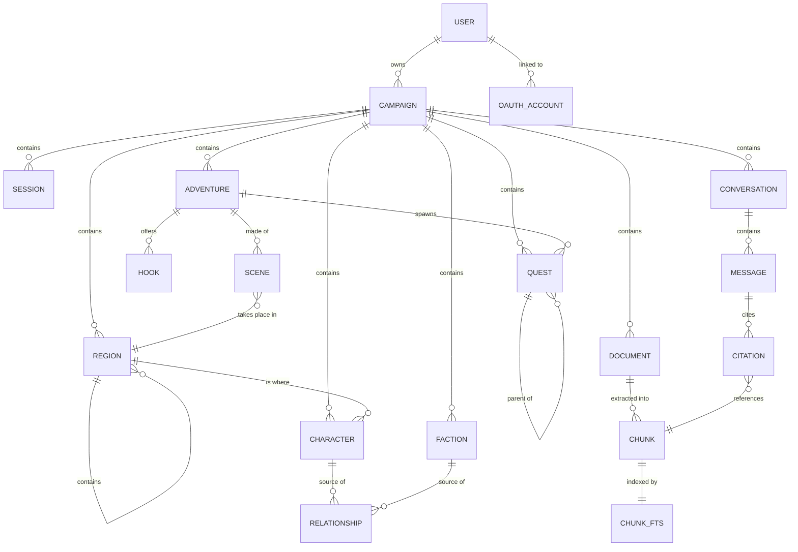

# Data Model

Derived from the entity shapes in the design prototype. Storage is a single SQLite
database ([ADR-0003](adr/adr-0003-sqlite-single-store.md)).

## Entity overview

## Core entities

### Campaign

The top-level isolation boundary. Everything else belongs to exactly one campaign.

| Field | Type | Notes |
|-------|------|-------|
| `id` | text PK | slug, e.g. `ashfall` |
| `name` | text | "Ashfall Reach" |
| `system` | text | **Required.** `D&D 2024` \| `Traveller 2e` |
| `image_path` | text? | user upload; falls back to a tint gradient |
| `tint` | text | hex accent for the placeholder banner |
| `session_count` | int | derived from sessions |
| `last_played_at` | date? | drives the "Jul 5" meta line |
| `created_at` | timestamp | |

### Character

**One entity for NPCs and player characters**, distinguished by `is_player`. The design
renders them through different views but shares stats, connections, and portrait handling.

| Field | Type | Notes |
|-------|------|-------|
| `id` | int PK | |
| `campaign_id` | text FK | |
| `name` | text | |
| `role` | text | "Human Cleric", "Merchant Prince" |
| `level` | int? | |
| `is_player` | bool | splits NPC list from Party list |
| `relationship` | enum | `ally` \| `enemy` \| `family` \| `professional` \| `neutral` — drives colour everywhere |
| `location` | text? | "The Party", "Market Row" |
| `disposition` | text? | "Steadfast", "Active" |
| `last_seen` | text? | "Session 13" |
| `armor_class`, `hit_points`, `speed` | text? | free-form; systems differ |
| `stats` | json | `[{k:"STR",v:14}, …]` — system-agnostic key/value |
| `quote` | text? | |
| `notes` | text? | GM-private notes |
| `portrait_path` | text? | |
| `tags` | json | `["Healer","Faith"]` |

**Player-character extension** (present when `is_player`), stored as a `player_profile`
JSON column rather than a separate table — it is always fetched with the character and
never queried independently:

`player_name`, `class`, `race`, `background`, `xp`, `pronouns`, `bonds`

### Faction

| Field | Type | Notes |
|-------|------|-------|
| `id` | int PK | |
| `campaign_id` | text FK | |
| `name` | text | "The Pale Court" |
| `type` | text | "Hidden cabal", "Merchant guild" |
| `relationship` | enum | same five values as Character |
| `influence` | text | "High", "Unknown" |
| `reach` | text | "Old Quarter", "Everywhere" |
| `motto` | text? | |
| `goal` | text? | |
| `notes` | text? | GM-private |

Faction membership is a join table `faction_member(faction_id, character_id)`. The
prototype stores members as names; real storage uses references so renames propagate.

### Relationship

Polymorphic edges powering the knowledge graph and the "Connections" lists on detail
pages. Characters and factions both participate.

| Field | Type | Notes |
|-------|------|-------|
| `id` | int PK | |
| `campaign_id` | text FK | |
| `source_type` | enum | `character` \| `faction` |
| `source_id` | int | |
| `target_type` | enum | `character` \| `faction` |
| `target_id` | int | |
| `kind` | enum | `ally` \| `enemy` \| `family` \| `professional` \| `neutral` |

Edges are treated as **undirected** for graph rendering; store one row per pair and
resolve in both directions on read.

### Quest

| Field | Type | Notes |
|-------|------|-------|
| `id` | int PK | |
| `campaign_id` | text FK | |
| `parent_quest_id` | int? FK | self-reference for subquests |
| `title` | text | |
| `subtitle` | text? | rendered as "Subquest of …" |
| `status` | enum | `available` \| `inprogress` \| `completed` \| `failed` \| `inactive` |
| `steps_done` | int | `cur` |
| `steps_total` | int | `max`; `0` means untracked |
| `color` | text | hex used by the portrait tile |
| `glyph` | text | single character for the tile |
| `is_person_quest` | bool | shows the person icon |

### Region

Places. A region contains other regions, so "the Old Quarter" holds "Market Row" holds
"The Gilded Flagon" — one entity type at every scale rather than separate Region and
Location tables.

| Field | Type | Notes |
|-------|------|-------|
| `id` | int PK | |
| `campaign_id` | text FK | |
| `parent_region_id` | int? FK | self-reference; null for top level |
| `name` | text | "The Old Quarter", "The Gilded Flagon" |
| `kind` | enum | `realm` \| `settlement` \| `district` \| `site` \| `building` \| `wilderness` |
| `is_notable` | bool | **Surfaces it on the parent's page** — see below |
| `summary` | text? | One line, for lists and hover cards |
| `description` | text? | What the party sees on arriving |
| `read_aloud` | text? | Boxed text to read at the table |
| `notes` | text? | GM-private: secrets, what is really going on |
| `image_path` | text? | |
| `tags` | json | `["Urban","Dangerous"]` |

**`is_notable` is a separate axis from hierarchy, deliberately.** The tavern where the party
always meets matters more than a street named once, regardless of how deep it nests. A
region's page shows its notable children as a short list a GM can reach in one click
mid-session; everything else stays in the tree. Without this, "easy to find" degrades into
"navigable if you remember where you put it".

Regions link to characters (`character.region_id`, replacing the free-text `location`) and
participate in `relationship` edges, so a faction can control a district and the graph shows
it.

### Adventure

A story unit above quests: premise, the reasons a party gets involved, and the scenes it is
made of. Modelled on how published modules are actually structured — background, hooks,
acts, NPCs, rewards.

| Field | Type | Notes |
|-------|------|-------|
| `id` | int PK | |
| `campaign_id` | text FK | |
| `title` | text | "The Broker's Old Bargain" |
| `premise` | text? | One paragraph: what this is about |
| `background` | text? | **GM-private.** What is really happening, which players discover through play |
| `status` | enum | `draft` \| `ready` \| `running` \| `completed` \| `abandoned` |
| `level_range` | text? | "3–5"; free-form, systems differ |
| `expected_sessions` | int? | Rough length |
| `region_id` | int? FK | Where it takes place |
| `notes` | text? | GM-private |
| `tags` | json | `["Intrigue","Urban"]` |

**`hook`** — the reasons a party might get involved. Published modules carry two to four,
each aimed at a different motivation, so a GM can pick the one that fits their table.

| Field | Type | Notes |
|-------|------|-------|
| `id` | int PK | |
| `adventure_id` | int FK | |
| `text` | text | "Kessel's writ names the party as investigators" |
| `motivation` | text? | "Duty", "Greed", "Revenge" — what kind of character it catches |

**`scene`** — the beats an adventure is made of. Ordered, but a GM runs them in whatever
order the table produces.

| Field | Type | Notes |
|-------|------|-------|
| `id` | int PK | |
| `adventure_id` | int FK | |
| `ordinal` | int | Suggested order |
| `title` | text | "Smoke over Riverside" |
| `purpose` | enum | `hook` \| `complication` \| `setback` \| `climax` \| `payoff` |
| `summary` | text? | What happens, in a line |
| `read_aloud` | text? | Boxed text |
| `gm_notes` | text? | GM-private: what can go wrong, what the NPCs want |
| `region_id` | int? FK | Where it happens |
| `is_optional` | bool | Skippable if time runs short |

**`purpose` follows the Five Room Dungeon**, a widely-used structure where each beat has a
job: hook the party, complicate, deepen with a setback, confront, then make it matter. It
is deliberately **not** about rooms — the same five beats structure urban intrigue and
investigation as well as dungeons, which is why the entity is `scene` rather than `room`.
The enum is a prompt, not a constraint: an adventure may have three scenes or nine, and
several may share a purpose.

**Joins**

| Table | Purpose |
|-------|---------|
| `adventure_character` | Which NPCs appear, with a `role` note ("the client", "the twist") |
| `adventure_faction` | Which factions are involved and how |
| `scene_character` | Which NPCs are present in a given scene |

Quests gain `adventure_id` (nullable) so a quest can belong to an adventure or stand alone.

### Document and Chunk

The ingestion pipeline's output. See [architecture.md](architecture.md).

**`document`**

| Field | Type | Notes |
|-------|------|-------|
| `id` | int PK | |
| `campaign_id` | text FK | |
| `filename` | text | "Core Rulebook v3.pdf" |
| `kind` | enum | `PDF` \| `DOC` \| `IMG` |
| `page_count` | int? | |
| `meta` | text? | "stat blocks · rules" |
| `status` | enum | `queued` \| `processing` \| `indexed` \| `failed` |
| `progress` | int | 0–100, drives the progress bar |
| `error` | text? | populated on `failed` |
| `file_path` | text | original on disk |
| `uploaded_at` | timestamp | |

**`chunk`**

| Field | Type | Notes |
|-------|------|-------|
| `id` | int PK | |
| `document_id` | int FK | |
| `ordinal` | int | position within document |
| `page_from`, `page_to` | int? | for citations |
| `heading` | text? | nearest section heading |
| `content` | text | the indexed text |

Retrieval uses an FTS5 virtual table over `chunk.content`
([ADR-0005](adr/adr-0005-fts5-before-vectors.md)).

### Session

| Field | Type | Notes |
|-------|------|-------|
| `id` | int PK | |
| `campaign_id` | text FK | |
| `title` | text | "The Vaults Below" |
| `played_on` | date | renders as day + month tile |
| `duration` | text? | "3h 40m" |
| `summary` | text? | plain-text summary |
| `body_html` | text? | rich-text composer output |
| `tags` | json | `["Combat","Discovery"]` |

Session bodies are chunked and indexed like documents, so past sessions are retrievable.

### Conversation, Message, Citation

| Entity | Key fields |
|--------|-----------|
| `conversation` | `id`, `campaign_id`, `started_at` |
| `message` | `id`, `conversation_id`, `role` (`user`\|`assistant`), `content`, `created_at`, `tool_label?` |
| `citation` | `id`, `message_id`, `chunk_id`, `quote?` |

Citations satisfy AC-002 and make grounding auditable.

### User

A real account. v1 authenticates ([ADR-0008](adr/adr-0008-own-auth-v1.md)).

| Field | Type | Notes |
|-------|------|-------|
| `id` | int PK | |
| `email` | text UNIQUE | The login identifier |
| `password_hash` | text? | **Nullable** — argon2. Null for Google-only accounts |
| `display_name` | text | "Game Master" |
| `table_name` | text? | "The Ashfall Table" |
| `avatar_path` | text? | Upload |
| `email_verified` | bool | |
| `created_at` | timestamp | |

`password_hash` is nullable so an account created through Google has no password at all —
storing a placeholder would be worse than storing nothing.

**Supporting tables**

| Table | Fields | Purpose |
|-------|--------|---------|
| `oauth_account` | `user_id`, `provider`, `provider_user_id` | Links a Google identity to a user |
| `password_reset` | `user_id`, `token_hash`, `expires_at`, `used_at` | Single-use reset tokens |
| `refresh_token` | `user_id`, `token_hash`, `expires_at`, `revoked_at` | Long-lived sessions |

**Tokens are stored hashed, never in the clear** — same reasoning as passwords. A database
read must not yield anything usable to log in with.

## Modelling decisions worth noting

**DEC-001 — Characters and players are one table.**
The design's `isPlayer` flag, shared stat block, and shared connection list make a single
table the honest model. Splitting them would duplicate every shared column and complicate
the graph, which does not care which kind a node is.

**DEC-002 — `stats` is JSON, not columns.**
D&D 2024 and Traveller 2e have different attributes. A fixed six-column stat block would
be wrong for one of the two systems the picker requires on day one.

**DEC-003 — Relationships are first-class rows, not embedded lists.**
The prototype embeds `connections` in each entity. Real storage needs edges queryable
from both ends to render a graph without loading every entity.

**DEC-005 — Campaigns carry `owner_id`; everything else scopes through campaign.**
`campaign.owner_id` references `user`. Characters, quests, and documents scope by
`campaign_id` and inherit ownership through it, so a single join answers "may this user see
this row?" Denormalising `owner_id` onto every table would create two sources of truth that
can disagree.

This makes `BND-003` load-bearing rather than tidy: with real users, a missed owner filter
is a data leak, not an inconvenience. Enforce it in the repository layer, and test it
(IMP-011 in [ADR-0008](adr/adr-0008-own-auth-v1.md)).

**DEC-006 — One Region entity at every scale, with notability as a separate flag.**
A realm, a district, and a tavern are the same kind of thing differing in scope, so one
self-referencing table beats parallel Region and Location tables that would need identical
columns and duplicate every relationship. `is_notable` then answers a different question
from `parent_region_id`: not *where does this sit* but *is this worth surfacing*. Depth in a
tree is a poor proxy for importance.

**DEC-007 — Scenes, not rooms.**
The Five Room Dungeon structure is about narrative beats, not floor plans — it works for
urban intrigue and investigation as well as dungeon crawls. Naming the entity `room` would
have quietly excluded most of what a game master actually runs.

**DEC-008 — `read_aloud` and `notes` are separate fields, everywhere they appear.**
Published modules distinguish boxed text (read to players) from GM-facing detail (what is
really happening). Merging them risks reading a secret aloud, which is unrecoverable at the
table. This extends DEC-004's private-notes convention rather than inventing a new one.

**DEC-004 — GM notes are private by construction.**
`notes` on characters and factions hold spoilers ("Do not reveal before Session 15").
They are never included in assistant context unless the GM asks about them explicitly.
