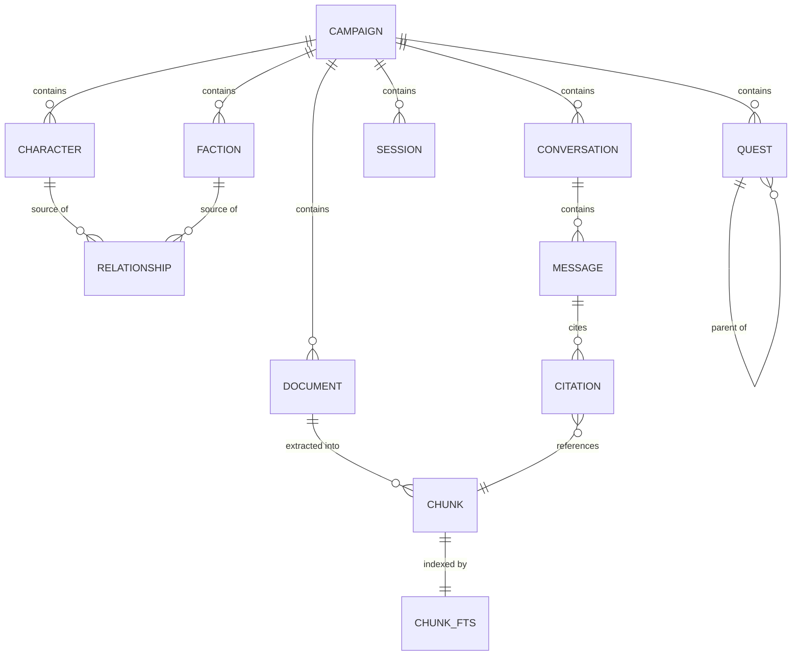

# Data Model

Derived from the entity shapes in the design prototype. Storage is a single SQLite
database ([ADR-0003](adr/adr-0003-sqlite-single-store.md)).

## Entity overview

## Core entities

### Campaign

The top-level isolation boundary. Everything else belongs to exactly one campaign.

| Field | Type | Notes |
|-------|------|-------|
| `id` | text PK | slug, e.g. `ashfall` |
| `name` | text | "Ashfall Reach" |
| `system` | text | **Required.** `D&D 2024` \| `Traveller 2e` |
| `image_path` | text? | user upload; falls back to a tint gradient |
| `tint` | text | hex accent for the placeholder banner |
| `session_count` | int | derived from sessions |
| `last_played_at` | date? | drives the "Jul 5" meta line |
| `created_at` | timestamp | |

### Character

**One entity for NPCs and player characters**, distinguished by `is_player`. The design
renders them through different views but shares stats, connections, and portrait handling.

| Field | Type | Notes |
|-------|------|-------|
| `id` | int PK | |
| `campaign_id` | text FK | |
| `name` | text | |
| `role` | text | "Human Cleric", "Merchant Prince" |
| `level` | int? | |
| `is_player` | bool | splits NPC list from Party list |
| `relationship` | enum | `ally` \| `enemy` \| `family` \| `professional` \| `neutral` — drives colour everywhere |
| `location` | text? | "The Party", "Market Row" |
| `disposition` | text? | "Steadfast", "Active" |
| `last_seen` | text? | "Session 13" |
| `armor_class`, `hit_points`, `speed` | text? | free-form; systems differ |
| `stats` | json | `[{k:"STR",v:14}, …]` — system-agnostic key/value |
| `quote` | text? | |
| `notes` | text? | GM-private notes |
| `portrait_path` | text? | |
| `tags` | json | `["Healer","Faith"]` |

**Player-character extension** (present when `is_player`), stored as a `player_profile`
JSON column rather than a separate table — it is always fetched with the character and
never queried independently:

`player_name`, `class`, `race`, `background`, `xp`, `pronouns`, `bonds`

### Faction

| Field | Type | Notes |
|-------|------|-------|
| `id` | int PK | |
| `campaign_id` | text FK | |
| `name` | text | "The Pale Court" |
| `type` | text | "Hidden cabal", "Merchant guild" |
| `relationship` | enum | same five values as Character |
| `influence` | text | "High", "Unknown" |
| `reach` | text | "Old Quarter", "Everywhere" |
| `motto` | text? | |
| `goal` | text? | |
| `notes` | text? | GM-private |

Faction membership is a join table `faction_member(faction_id, character_id)`. The
prototype stores members as names; real storage uses references so renames propagate.

### Relationship

Polymorphic edges powering the knowledge graph and the "Connections" lists on detail
pages. Characters and factions both participate.

| Field | Type | Notes |
|-------|------|-------|
| `id` | int PK | |
| `campaign_id` | text FK | |
| `source_type` | enum | `character` \| `faction` |
| `source_id` | int | |
| `target_type` | enum | `character` \| `faction` |
| `target_id` | int | |
| `kind` | enum | `ally` \| `enemy` \| `family` \| `professional` \| `neutral` |

Edges are treated as **undirected** for graph rendering; store one row per pair and
resolve in both directions on read.

### Quest

| Field | Type | Notes |
|-------|------|-------|
| `id` | int PK | |
| `campaign_id` | text FK | |
| `parent_quest_id` | int? FK | self-reference for subquests |
| `title` | text | |
| `subtitle` | text? | rendered as "Subquest of …" |
| `status` | enum | `available` \| `inprogress` \| `completed` \| `failed` \| `inactive` |
| `steps_done` | int | `cur` |
| `steps_total` | int | `max`; `0` means untracked |
| `color` | text | hex used by the portrait tile |
| `glyph` | text | single character for the tile |
| `is_person_quest` | bool | shows the person icon |

### Document and Chunk

The ingestion pipeline's output. See [architecture.md](architecture.md).

**`document`**

| Field | Type | Notes |
|-------|------|-------|
| `id` | int PK | |
| `campaign_id` | text FK | |
| `filename` | text | "Core Rulebook v3.pdf" |
| `kind` | enum | `PDF` \| `DOC` \| `IMG` |
| `page_count` | int? | |
| `meta` | text? | "stat blocks · rules" |
| `status` | enum | `queued` \| `processing` \| `indexed` \| `failed` |
| `progress` | int | 0–100, drives the progress bar |
| `error` | text? | populated on `failed` |
| `file_path` | text | original on disk |
| `uploaded_at` | timestamp | |

**`chunk`**

| Field | Type | Notes |
|-------|------|-------|
| `id` | int PK | |
| `document_id` | int FK | |
| `ordinal` | int | position within document |
| `page_from`, `page_to` | int? | for citations |
| `heading` | text? | nearest section heading |
| `content` | text | the indexed text |

Retrieval uses an FTS5 virtual table over `chunk.content`
([ADR-0005](adr/adr-0005-fts5-before-vectors.md)).

### Session

| Field | Type | Notes |
|-------|------|-------|
| `id` | int PK | |
| `campaign_id` | text FK | |
| `title` | text | "The Vaults Below" |
| `played_on` | date | renders as day + month tile |
| `duration` | text? | "3h 40m" |
| `summary` | text? | plain-text summary |
| `body_html` | text? | rich-text composer output |
| `tags` | json | `["Combat","Discovery"]` |

Session bodies are chunked and indexed like documents, so past sessions are retrievable.

### Conversation, Message, Citation

| Entity | Key fields |
|--------|-----------|
| `conversation` | `id`, `campaign_id`, `started_at` |
| `message` | `id`, `conversation_id`, `role` (`user`\|`assistant`), `content`, `created_at`, `tool_label?` |
| `citation` | `id`, `message_id`, `chunk_id`, `quote?` |

Citations satisfy AC-002 and make grounding auditable.

### Profile

A **single row**. v1 is local-first and single-user, so this holds the GM's own details
for display — it is not an account.

| Field | Type | Notes |
|-------|------|-------|
| `id` | int PK | Always `1` in v1 |
| `display_name` | text | "Game Master" |
| `table_name` | text? | "The Ashfall Table" |
| `email` | text? | A label only. Nothing is sent to it, nothing authenticates against it |
| `avatar_path` | text? | Upload |

**There is no password column, and that is deliberate.** Adding one would imply security
this does not provide. The design's login screen is a profile picker: "Sign in" and
"Continue with Google" both proceed to the campaign picker without checking anything.

When hosting arrives, this row is replaced by real accounts in Supabase Auth, and entities
gain an `owner_id` ([ADR-0007](adr/adr-0007-local-profile-auth.md)).

## Modelling decisions worth noting

**DEC-001 — Characters and players are one table.**
The design's `isPlayer` flag, shared stat block, and shared connection list make a single
table the honest model. Splitting them would duplicate every shared column and complicate
the graph, which does not care which kind a node is.

**DEC-002 — `stats` is JSON, not columns.**
D&D 2024 and Traveller 2e have different attributes. A fixed six-column stat block would
be wrong for one of the two systems the picker requires on day one.

**DEC-003 — Relationships are first-class rows, not embedded lists.**
The prototype embeds `connections` in each entity. Real storage needs edges queryable
from both ends to render a graph without loading every entity.

**DEC-005 — Every table carries `campaign_id`; none carries an owner yet.**
Campaign is the isolation boundary in v1. When hosting arrives, adding `owner_id` is one
column plus a backfill rather than a re-model — the reason the migration in
[ADR-0007](adr/adr-0007-local-profile-auth.md) stays cheap.

**DEC-004 — GM notes are private by construction.**
`notes` on characters and factions hold spoilers ("Do not reveal before Session 15").
They are never included in assistant context unless the GM asks about them explicitly.
