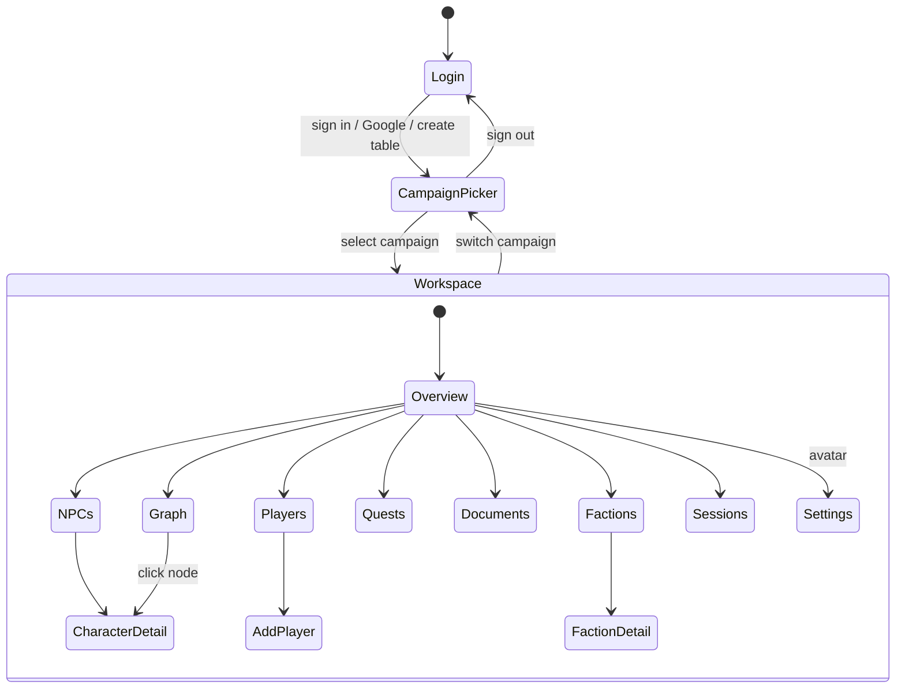

# Design

Screens, layout, and behaviour. Exact values live in [reference.md](reference.md).

## The prototype

**▶ [Open the interactive design](https://claude.ai/code/artifact/a7d4de30-0826-4747-b295-a584fe6f0f28)**

This is the source of truth. It is the running prototype, not a picture of one — click
through the login and campaign picker into the workspace, switch views from the nav rail,
hover a graph node, toggle the assistant panel, and resize below 900px to see the mobile
shell.

Prefer it over any screenshot. A screenshot captures one frame of one state and goes stale
silently; the prototype shows current behaviour, and interaction is most of what this
design specifies.

Two things to know about the link:

- It is **pinned to a published version**. Republishing the design does not change what
  this link shows until the share pin is moved — deliberate, so the documented design
  cannot shift underfoot mid-implementation.
- Fidelity is **high**. Colors, type, spacing, and interaction states are final as shown.

**Do not port the prototype's code.** It is a `.dc.html` reference with an inline runtime;
read it for structure, layout, and exact values only, and rebuild with the project's own
primitives (BND-004). Its values are transcribed into [reference.md](reference.md), which
is what implementation should follow.

Source project: Claude Design `ec1d38ec-c81f-42b8-8952-7a922851f405`, file
`Referee Workspace.dc.html`.

## Screen model

Two levels of routing. A top-level `screen`, and within the workspace, a `view`.

Routes map to URLs: `/login`, `/campaigns`, `/c/:campaignId/:view`.

## 1. Login

Full-viewport, vertically centred card on the login radial gradient.

- Card `max-width: 400px`, `--surface-raised`, `1px --border-subtle`,
  `--radius-panel`, `--shadow-card`, padding `26px 24px 24px`
- Brand lockup above the card: 58×58 tile, `--radius-brand`, gradient fill, amber ✦ spark;
  "Referee" 27px/600 Crimson Pro over "ASSISTANT" 11px, `letter-spacing .14em`, muted
- "Sign in" heading 20px Crimson Pro; subtitle "Continue to your table"
- Email and password inputs: 44px, `--radius-button`, `--surface-sunken`,
  `1px --border-default`; focus border `--accent`
- "Forgot?" link right-aligned above the password field
- Primary button: 46px, `--accent` background, `#0A0C0F` text, `--shadow-accent`,
  hover `brightness(1.06)`
- OR divider — hairline with centred "OR"
- Google button: 44px, `--surface-elevated`, `1px --border-emphasis`, four-color G glyph,
  hover border `--border-emphasis` → `#5A6270`
- Footer: "New to Referee? Create a table"

**Behaviour.** All three actions advance to the campaign picker. v1 has no real auth
(PRIN-004); the screen establishes the local profile.

## 2. Campaign Picker

Full-viewport scroll on the landing radial gradient.

- Header row: brand lockup left; right cluster is "Sign out" plus a 40px avatar
  (`--radius-button`) that opens Settings
- Responsive grid of campaign cards: banner (uploaded image or tint gradient), title in
  Crimson Pro, system badge ("D&D 2024", "Traveller 2e"), meta line
  `Session {n} · {system}`
- An "Add campaign" affordance opens the add-campaign modal

**Add-campaign modal.** Image upload plus a **mandatory** system choice. Create is
disabled until both a name and a system are set. On create, the campaign is added and the
app enters the workspace at Overview.

## 3. Workspace shell

Desktop grid: columns `76px minmax(0,1fr) <panel>` where panel is `400px` open or `0`
closed; rows `--header-height` then content. `height:100vh; width:100vw`.

### Header

Spans all columns. `--surface-app`, bottom border `1px --border-subtle`,
`padding: 0 20px 0 100px`. Shows active campaign name and
`Session {n} · {system}`. Right side: avatar → Settings.

### Floating nav rail

`position: fixed; left: 24px; top: 50%; translateY(-50%)`. Collapsed 60px, icon-only;
expands to 236px on hover **or** when pinned. `--surface-raised`,
`1px --border-strong`, `--radius-rail`, shadow swaps with state.

Items, in order: Overview, NPCs, Players, Factions, Quest Log, Documents,
Knowledge Graph, Sessions. Active item uses `--accent`; labels fade in only when expanded.

### AI panel

Right column, `--surface-sunken`, left border `1px --border-subtle`.

- Header: 34px spark tile, "Assistant" over "Grounded in indexed material", a provider
  pill (mono, green dot, current provider — click switches), and a close button
- Message list: assistant bubbles `--surface-raised` with `14px 14px 14px 4px` radius;
  user bubbles mirrored. Tool-call chips render above content as a green check row in
  mono at 11.5px
- Streaming: a 7×15px accent block with `blink` animation trails the streaming message
- Typing indicator: three dots with staggered `dotpulse`
- Composer: attach button, auto-growing textarea (`max-height: 120px`,
  placeholder "Ask, search, or draft a scene…"), send button. Quick-prompt chips sit
  above the composer when the conversation is short
- Auto-scrolls to the newest message

When closed on desktop, a pill FAB ("✦ Assistant") appears bottom-right.

## 4. Workspace views

| View | Content |
|------|---------|
| **Overview** | Hero block plus a 4-up stat grid and a recent-activity list |
| **NPCs** | Relationship filter chips (All / Allies / Enemies / Family / Pro / Neutral) over a card grid. Cards show portrait, name, role, level, location, tags, and a relationship-coloured accent |
| **Players** | Party cards showing character and player name, class, level; "Add Player" opens a form view |
| **Factions** | Cards with name, type, influence, motto, member count, relationship colour |
| **Quests** | Status tabs (Available / In progress / Completed / Failed / Inactive) over rows with gradient glyph tile, title, subquest line, progress bar, and actions. Failed and inactive quests offer Reactivate |
| **Documents** | List with type badge, page count, meta line, status pill (`Indexed` green / `Processing` accent / `Queued` muted) and a progress bar |
| **Knowledge Graph** | Interactive node graph with relationship legend and search |
| **Sessions** | Date-tile entries with title, duration, tags, and summary; a rich-text composer creates new entries |
| **Settings** | Reached via avatar, not the rail |

### Detail views

**Character detail** — portrait with upload, name, role, level, disposition, last seen;
AC / HP / Speed; a stat grid (`--surface-elevated` tiles, mono label over Crimson Pro
value); connections list with relationship dots; quote; GM notes. Player characters add a
block with player name, class, race, background, XP, pronouns, and bonds.

**Faction detail** — name, type, influence, reach, motto, goal, members, connections,
GM notes.

### Settings

`max-width: 1080px`, two columns `1fr 1fr`, gap `26px 28px`, `align-items: start`;
collapses to one column ≤900px.

- **Left — Account.** Card `--surface-raised`, `1px --border-subtle`, `--radius-card`.
  Avatar upload; inner `1fr 1fr` grid with Display name and Table/group paired, Email
  spanning `grid-column: 1/-1`. Inputs 40px, `--radius-input`.
- **Right — AI Gateway.** Provider radio rows (Claude, Ollama) where the selected row
  shows a 16px ring with a 5px `--accent` border; unselected shows `1.5px --border-emphasis`.
  Below, a green-tinted callout (`--success-wash`, `--success-border`, check icon)
  explaining gateway routing.
- Footer actions: Cancel (ghost) and Save changes (accent), right-aligned.

## 5. Knowledge Graph

- Nodes are characters and factions; edges are coloured by relationship kind
- A legend lists all five relationship colours
- **Search** highlights matching nodes and dims the rest
- **Hover** pops an info card with relationship, role, faction, and level
- **Click** navigates to that entity's detail view

v1 renders real relationship data and supports search, hover, and navigation. Editing
relationships from the graph is deferred (see [mvp-scope.md](../mvp-scope.md)).

## 6. Mobile (≤900px)

- Nav rail hidden; main becomes a single column with bottom padding for the tab bar
- **Bottom tab bar** — fixed, `--tabbar-height`, `rgba(14,16,21,.94)` with
  `backdrop-filter: blur(14px)`, top border `1px --border-subtle`. Five items: Home,
  NPCs, Party, Quests, More. Active `--accent`, inactive `--text-muted`
- **More sheet** — bottom sheet, `--surface-raised`, rounded top `--radius-rail`, grab
  handle, `rise` entrance, dimming backdrop. Rows: Factions, Documents, Knowledge Graph,
  Sessions
- **AI panel** — right slide-over, `--panel-width-mobile`,
  `transform: translateX(0 | 105%)` over `--transition-slideover`, with backdrop.
  A 54px round accent FAB at `bottom: 80px` opens it
- Grid reflows: stats → 2 columns, stat block → 3 columns, settings → 1 column,
  player detail → 1 column at ≤560px

Layout mode is tracked in JS as well as CSS, because it changes behaviour: the AI panel
defaults **open on desktop** and **closed on mobile**.

## Interaction rules

- **Transitions** — rail `.26s`, slide-over `.3s`, hover `.15s`, all on `--ease`
- **Backdrops** — `--backdrop` with `blur(2px)`; clicking dismisses
- **Hover depth** — cards lift border colour toward `--border-emphasis`
- **Focus** — inputs move their border to `--accent`
- **Scroll** — 9px custom scrollbar, `--scrollbar-thumb`, transparent track

## Gaps requiring design

Listed in [mvp-scope.md](../mvp-scope.md) and repeated here as build blockers:

1. Upload interaction and its immediate feedback
2. Extraction `Failed` state and retry
3. Empty states for a new campaign — the first thing a new user sees
4. How a citation renders inside an assistant bubble
