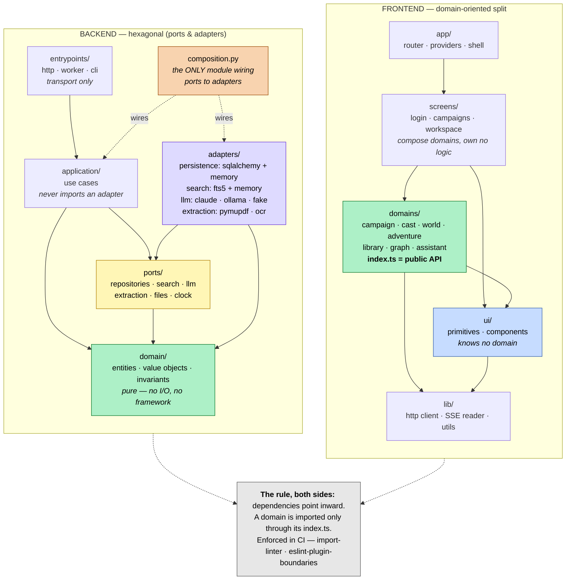

# Folder Structure

How the two applications are organised on disk, and the dependency rules that keep those
boundaries real.

- **Backend** — hexagonal architecture (ports and adapters). Every outside dependency,
  storage included, sits behind a port the domain owns.
- **Frontend** — a domain-oriented split. Bounded contexts with published interfaces, and
  a thin tactical layer where the client holds genuine rules.

The two apps share no code, but they share one idea: volatile things at the edge, stable
things at the centre, every dependency pointing inward.

## At a glance

The same shape as a diagram. Both applications, and the one dependency rule they share.



This block is also what the [architecture board](https://miro.com/app/board/uXjVHrcVIJQ=/)
renders — Miro imports it directly via **Diagram → Mermaid**, so the board and this file
stay the same drawing rather than two that drift apart.

## Backend

```
backend/
├── app/
│   ├── domain/                    # The hexagon's interior. Pure. Zero I/O, zero framework.
│   │   ├── campaign/
│   │   │   ├── entities.py        # Campaign, User — identity and lifecycle
│   │   │   ├── values.py          # CampaignId, SystemRef — immutable, self-validating
│   │   │   └── policies.py        # ownership and scoping rules
│   │   ├── cast/                  # Character, Faction, Relationship
│   │   │   ├── entities.py
│   │   │   ├── values.py          # StatBlock, Disposition, RelationshipKind
│   │   │   └── graph.py           # relationship traversal, pure
│   │   ├── world/                 # Region, Quest, Session
│   │   ├── adventure/             # the richest context — real invariants live here
│   │   │   ├── entities.py        # Adventure (root), Scene, Front
│   │   │   ├── values.py          # Beat, ReadAloud, PrivateNote, Motivation
│   │   │   ├── clues.py           # Clue, Secret, the three-clue rule
│   │   │   └── structure.py       # procedural vs story-driven shapes
│   │   ├── library/               # Document, Chunk, Citation, ExtractionState
│   │   ├── assistant/             # Conversation, Message, Mode, Proposal
│   │   └── shared/                # cross-context value objects, domain errors
│   │
│   ├── ports/                     # Interfaces the domain declares. No implementations.
│   │   ├── repositories.py        # CampaignRepo, CastRepo, AdventureRepo, LibraryRepo…
│   │   ├── search.py              # SearchIndex — index(), query() → ranked refs
│   │   ├── llm.py                 # LLMProvider — prompt(), stream() over domain events
│   │   ├── extraction.py          # TextExtractor — bytes → pages
│   │   ├── files.py               # FileStore — put(), get(), delete()
│   │   ├── clock.py               # Clock — time is an injected dependency
│   │   └── events.py              # EventPublisher — domain events out
│   │
│   ├── application/               # Use cases. One class or function per operation.
│   │   ├── campaign/              # CreateCampaign, SwitchCampaign…
│   │   ├── library/               # UploadDocument, IngestDocument, RetryExtraction
│   │   ├── retrieval/             # SearchLibrary, AssembleContext
│   │   ├── assistant/             # RunAssistantTurn — the loop, orchestration only
│   │   ├── adventure/             # DraftAdventure, AcceptProposal, ValidateClues
│   │   └── dto.py                 # command/result shapes crossing the boundary
│   │
│   ├── adapters/                  # The outside world. Implementations of ports.
│   │   ├── persistence/
│   │   │   ├── sqlalchemy/
│   │   │   │   ├── tables.py      # schema — mapped to domain, not equal to it
│   │   │   │   ├── mappers.py     # row ↔ entity translation
│   │   │   │   ├── repositories/  # one per repository port
│   │   │   │   ├── unit_of_work.py
│   │   │   │   └── migrations/
│   │   │   └── memory/            # in-memory repos — the fast test double
│   │   ├── search/
│   │   │   ├── fts5.py            # SQLite FTS5 SearchIndex
│   │   │   └── memory.py
│   │   ├── llm/
│   │   │   ├── claude.py          # the only file importing the Anthropic SDK
│   │   │   ├── ollama.py
│   │   │   ├── prompts/           # one strategy per assistant mode
│   │   │   └── fake.py            # scripted provider for deterministic tests
│   │   ├── extraction/
│   │   │   ├── pymupdf.py
│   │   │   └── ocr.py
│   │   └── files/local.py
│   │
│   ├── entrypoints/               # Driving adapters. Transport, nothing else.
│   │   ├── http/
│   │   │   ├── routers/           # one per resource
│   │   │   ├── schemas/           # Pydantic — wire shapes, never domain types
│   │   │   ├── streaming.py       # SSE event emission
│   │   │   └── errors.py          # domain error → HTTP status
│   │   ├── worker/                # background ingestion runner
│   │   └── cli/                   # admin and maintenance commands
│   │
│   ├── composition.py             # the ONLY module wiring ports to adapters
│   └── config.py
│
├── tests/
│   ├── domain/                    # pure unit tests, no doubles needed
│   ├── application/               # use cases against in-memory adapters
│   ├── adapters/                  # contract tests — every adapter, same suite
│   ├── entrypoints/               # HTTP integration
│   └── architecture/              # the dependency rules, executable
└── pyproject.toml
```

### The dependency rule

Everything points inward. The domain knows nothing about the world.

```
entrypoints ──┐
              ├──→ application ──→ ports ←── adapters
              │         │            ↑
              └─────────┴──→ domain ─┘
```

| Layer | May import | May **not** import |
|-------|-----------|-------------------|
| `domain` | stdlib only | everything else in `app` |
| `ports` | `domain` | `application`, `adapters`, `entrypoints` |
| `application` | `domain`, `ports` | `adapters`, `entrypoints` |
| `adapters` | `domain`, `ports` | `application`, `entrypoints`, other adapters |
| `entrypoints` | `application`, `domain` | `adapters` |
| `composition` | everything | — |

Two consequences worth stating plainly:

**`application` never imports `adapters`.** A use case receives a `CampaignRepo`, not a
`SqlAlchemyCampaignRepo`. It cannot know which it got, which is what makes it testable
without a database.

**`entrypoints` never imports `adapters` either.** The router asks for a use case;
`composition.py` decided months ago what that use case is holding. Only one file in the
codebase names both sides of a port.

### Ports, and the ones that matter

| Port | Real implementations | What it buys |
|------|---------------------|--------------|
| `repositories` | SQLAlchemy, in-memory | Domain tests run with no database at all |
| `search` | FTS5, in-memory | Ranking strategy swaps without touching retrieval logic |
| `llm` | Claude, Ollama, fake | Provider is configuration; tests are deterministic |
| `extraction` | PyMuPDF, OCR | A second parser is a new file, not a refactor |
| `files` | local disk | Object storage later is one adapter |
| `clock` | system, frozen | Time-dependent behaviour is testable without sleeping |

Storage behind a port has a cost worth naming: the schema in `tables.py` is no longer the
domain model, so `mappers.py` must translate. That is the price of the domain not knowing
SQL exists. What it buys is the in-memory repository — the whole `application` test suite
runs in milliseconds against real use cases, and the SQLAlchemy adapter is verified once by
the shared contract suite rather than re-tested through every feature.

**Contract tests are what keep ports honest.** One suite per port, run against every
implementation. If the in-memory repo and the SQLAlchemy repo both pass the same tests,
swapping them cannot change behaviour — and a test double that drifts from the real thing
stops being a useful double.

### The aggregate boundary

`Adventure` is the one context with rules worth defending, so it is a proper aggregate:

- Scenes, beats, and read-aloud text are reached **through** the Adventure root, never
  loaded independently
- `ReadAloud` and `PrivateNote` are distinct value objects, not two strings. The type
  system prevents assigning one where the other belongs — reading a secret aloud at the
  table is unrecoverable, so it should be a compile-time error rather than a convention
- Clues are their own aggregate, referenced by id. A clue can surface in several scenes,
  so owning it inside one would be the single point of failure the three-clue rule exists
  to prevent
- `AdventureRepo.save()` persists the whole aggregate transactionally

Elsewhere, entities are simpler and the aggregate machinery would be ceremony. Use it
where invariants exist; do not spread it evenly for symmetry.

## Frontend

```
frontend/
├── src/
│   ├── app/                       # composition root
│   │   ├── router.tsx
│   │   ├── providers.tsx          # Query client, theme, error boundary
│   │   └── shell/                 # header, nav rail, panel slot, mobile tab bar
│   │
│   ├── domains/                   # bounded contexts. The unit of ownership.
│   │   ├── campaign/
│   │   │   ├── model/             # types, value objects, pure derivations
│   │   │   ├── api/               # endpoints + query hooks
│   │   │   ├── components/        # domain-specific UI
│   │   │   ├── store.ts           # Zustand slice, if needed
│   │   │   └── index.ts           # PUBLIC API — the only legal import path
│   │   ├── cast/
│   │   ├── world/
│   │   ├── adventure/
│   │   │   ├── model/
│   │   │   │   ├── types.ts
│   │   │   │   ├── clue-coverage.ts    # the three-clue check
│   │   │   │   ├── structure.ts        # beat shapes, template outlines
│   │   │   │   └── proposal.ts         # draft vs accepted state machine
│   │   │   ├── api/
│   │   │   ├── components/
│   │   │   └── index.ts
│   │   ├── library/
│   │   ├── graph/
│   │   └── assistant/
│   │
│   ├── screens/                   # routed pages. Compose domains, own no logic.
│   ├── ui/                        # design-system primitives. Knows no domain.
│   │   ├── primitives/            # Radix wrappers
│   │   ├── components/            # Button, Input, Card, Badge, ProgressBar
│   │   └── *.module.css
│   ├── styles/                    # tokens.css, reset, global
│   └── lib/                       # http client, SSE reader, hooks, utils
│
├── tests/
│   ├── e2e/
│   └── architecture/
└── vite.config.ts
```

### The import rule

> **A domain may only be imported through its `index.ts`.**
> `domains/cast` may import `domains/campaign`; it may never import
> `domains/campaign/api/useCampaign`.

| Layer | May import | May **not** import |
|-------|-----------|-------------------|
| `app` | everything | — |
| `screens` | `domains/*` (public API), `ui`, `lib` | another screen |
| `domains/x` | `domains/y` (public API), `ui`, `lib` | `screens`, `app`, deep paths |
| `ui` | `lib`, `styles` | `domains`, `screens` |
| `lib` | third-party | `domains`, `screens`, `ui` |

Deep imports are what turn a domain split into a ball of mud. With this many
cross-referencing entities it happens within a month unenforced, so the barrel file is not
bureaucracy — it is the thing that lets a domain's internals be refactored without grepping
the codebase.

`ui/` staying domain-ignorant is what makes Storybook worth having: a primitive that
imports a Character type cannot be rendered in isolation.

### How much tactical DDD on the client

Bounded contexts and published interfaces: yes, throughout. Tactical patterns: only in
`model/`, and only where the client holds a rule the server does not decide for it.

Most domains have thin models — types and formatting. `adventure/model/` is the exception,
because authoring is genuinely client-side: clue coverage must warn *as the GM types*,
draft-versus-accepted is a state machine the UI owns until submission, and beat structure
is read live to show an adventure's shape. Those are pure functions and discriminated
unions over data the server returned — not aggregates, and not a second copy of the
server's validation.

The rule: if the server decides it, the client does not model it. If the client decides it
before a request is made, the client models it properly.

### State, by concern

- **Server state** — TanStack Query hooks in `domains/*/api/`. Keys namespaced by domain,
  always including `campaignId`, so switching campaigns invalidates cleanly.
- **UI state** — Zustand slices in `domains/*/store.ts`; shell state in `app/shell/`.
  Ephemeral, never persisted.
- **Streaming** — generic SSE reader in `lib/`, event semantics in `domains/assistant/`.

## Enforcement

Prose boundaries drift. Both rule sets run in CI, and a violation fails the build.

| Side | Tool | Enforces |
|------|------|----------|
| Backend | `import-linter` contracts in `pyproject.toml` | the layer table |
| Frontend | `eslint-plugin-boundaries` + `no-restricted-imports` | the import table, deep-import ban |

`tests/architecture/` additionally asserts what lint cannot: that no SDK is imported
outside its adapter, and that `application` is reachable without importing a single
adapter module.

## Trade-offs worth knowing

**This is more structure than a small app needs.** The mapper layer, the port definitions,
and the double repository implementation are real overhead — perhaps 15% more files for the
same behaviour. It pays off when the domain is the valuable part and the infrastructure is
replaceable, which is the bet being made here. If the domain turns out to be thin, this
will feel like ceremony, and collapsing `ports` into `application` is the cheapest retreat.

**The hexagon's weakest seam is the mapper.** Every schema change touches `tables.py`,
`mappers.py`, and the entity. Keeping the schema *close* to the domain shape — mapping,
not translating — keeps that cost low; letting them diverge for convenience is what makes
people abandon the pattern.

**Frontend domains will want to share types.** Resist a `shared/domain` grab-bag: put
genuinely cross-context types in `lib/`, and let one domain import another's public API for
the rest. A shared bucket becomes the place every rule goes to hide.

**Symmetry between the two apps is a goal, not a rule.** They point dependencies the same
way and name contexts the same way. They do not need the same layer count, and forcing the
backend's ports onto a client that protects no invariants would be pattern-matching rather
than design.
